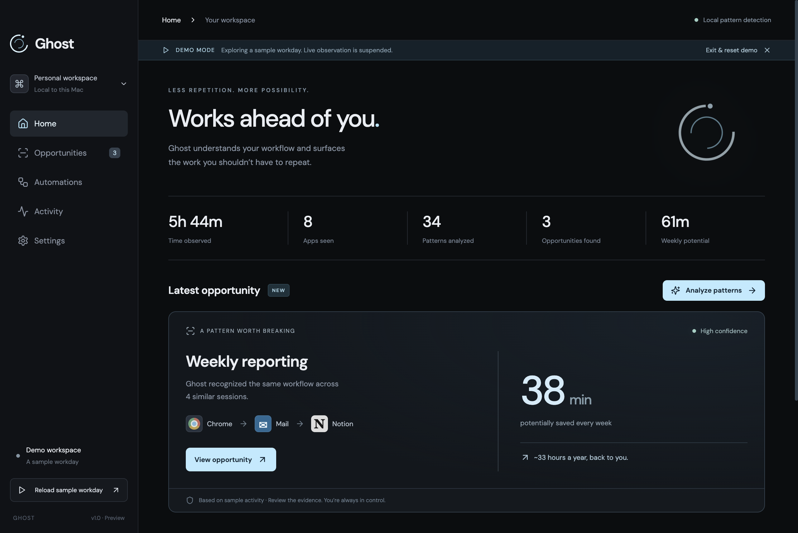
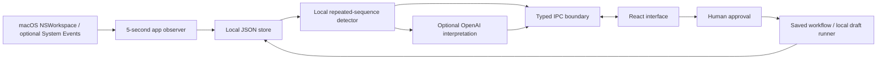

# Ghost

**Works ahead of you.**

Ghost is a local-first macOS desktop prototype that discovers repeated workflows from lightweight app activity, explains the evidence, and turns approved opportunities into saved, runnable draft workflows.



## The problem

People waste time repeating workflows they do not realize can be automated. Asking an AI for help still requires knowing what to ask for.

## The idea

Ghost discovers automation opportunities automatically. Instead of starting with a prompt, it starts with the pattern: “You keep doing this. Here’s a way to do less of it.”

## How it works

**Observe → Understand → Detect → Suggest → Automate**

1. Observe the foreground macOS application every five seconds.
2. Merge contiguous observations into timed sessions.
3. Detect repeated three-app sequences locally, every minute or on demand.
4. Show the recurrence, underlying sessions, confidence, and estimated savings.
5. Optionally use OpenAI to interpret structured evidence.
6. Review and edit the proposed workflow, then explicitly activate it.
7. Run the saved workflow manually with supplied context to generate a local report draft.

## Features

- Native Electron desktop app with a restrained dark interface and offline bundled fonts.
- Five views: Home, Opportunities, Automations, Activity, and Settings.
- Genuine macOS foreground-app observation without keystroke logging.
- Optional window titles, with graceful fallback when permissions are unavailable.
- Background local discovery and explicit AI analysis.
- Evidence-backed reporting, meeting follow-up, and file organization sample opportunities.
- Editable workflow creation, persisted activation, pause/resume/delete, and local draft generation.
- Reliable demo reset and replay, isolated from live activity.
- Menu-bar access and optional launch at login; closing the window keeps observation running.
- Unsigned macOS DMG and ZIP distribution.

## Architecture



- `src/main/main.ts`: Electron lifecycle, observation, validated IPC, AI requests, and tray.
- `src/main/store.ts`: atomic local persistence with restrictive file permissions.
- `src/main/draft.ts`: extractive report generation from supplied context.
- `src/main/preload.ts`: narrow renderer API; no arbitrary shell or filesystem access.
- `src/shared/detection.ts`: deterministic sequence detection, demo generator, AI validation, and savings math.
- `src/renderer/`: React product experience and styling.
- `tests/`: unit tests and a real Electron end-to-end test.

Renderer Node integration is disabled. Context isolation and sandboxing are enabled. External navigation and permission requests are blocked. A Content Security Policy prevents renderer network requests. Only the main process can make the configured AI request.

## Privacy

**Collected:** app name, session start time, approximate duration, source (live/sample), and optional window title. Contiguous observations are merged. At most 10,000 recent sessions are retained.

**Not collected:** keystrokes, clipboard contents, screenshots, document bodies, passwords, or browser history. Window titles may themselves contain sensitive text; they are off by default.

Activity and workflow data are stored in Electron's local user-data directory (`~/Library/Application Support/ghost-desktop/` when running from source). Storage is local JSON, not application-level encrypted. API keys entered in Settings are encrypted using Electron `safeStorage` and the macOS Keychain-backed mechanism. Keys are never returned to the renderer or committed to Git.

When AI is enabled and you explicitly choose **Analyze patterns**, Ghost sends detected patterns and up to 120 supporting structured sessions to OpenAI. This includes window titles if collected. No background AI calls occur. OpenAI's service policies apply to those requests.

Pause stops collection. Demo Mode suspends live collection. Delete History removes sessions and detected opportunities; saved workflow snapshots and generated drafts remain until their workflows are deleted. Reset Demo removes sample sessions, sample opportunities, and sample workflows while retaining live data. No telemetry or remote fonts are used.

## Running locally

Requires macOS and Node.js 22 or newer, plus npm.

```bash
npm install
npm run dev
```

`dev` builds the renderer and main process, then launches Electron. Restart it after source changes. No API key is required. Quit from the menu-bar menu or with Cmd+Q; the red close button hides the window.

```bash
npm test          # deterministic detector, validation, persistence, math
npm run test:e2e # builds and launches real Electron, captures screenshots
npm run build    # TypeScript check and production bundles
```

The end-to-end test uses a temporary user-data folder, so it does not change your personal Ghost data. It verifies first run, sample loading, detection, evidence, workflow construction, activation, draft execution, pause/resume, persistence across relaunch, reset, and live macOS observation.

## Building for macOS

```bash
npm run dist
```

Outputs on an Apple Silicon Mac:

- `release/Ghost-1.0.0-arm64.dmg`
- `release/Ghost-1.0.0-arm64-mac.zip`
- `release/mac-arm64/Ghost.app`

The hackathon build is **unsigned and not notarized**. Downloaded copies may be blocked by Gatekeeper; use macOS's explicit **Open Anyway** option in Privacy & Security only for a build you trust. Distribution outside the hackathon should use Developer ID signing and notarization. This repository's tested artifact is Apple Silicon; Intel builds have not been tested.

## Demo Mode

Choose **Try Demo** at onboarding, or **Explore Demo Mode** in the sidebar.

The sample contains four weekly reporting sessions, four meeting follow-up sessions, and four file organization sessions. It is explicitly labeled as sample data throughout. Click **Analyze patterns** to run the actual detector against those sessions.

The central example is **Chrome → Mail → Notion**, repeated four times, averaging 38 minutes. Estimated annual potential is calculated as `38 × 52 / 60 = 32.93 hours`.

Choose **View opportunity**, expand the evidence, choose **Automate this**, watch the workflow reveal, and **Activate workflow**. Run **Inspect & run draft** to generate a real local draft from editable sample metrics. Exit/reset removes all demo data. Reloading a sample workday clears prior sample workflows for a fresh presentation.

Clean screenshots are in `docs/screenshots/`; `npm run test:e2e` regenerates them. The presentation script is in `docs/DEMO_SCRIPT.md`.

## AI

Settings accepts an OpenAI API key and model name (default `gpt-4.1-mini`). Alternatively launch with `OPENAI_API_KEY` in your shell environment. An environment key takes precedence over an encrypted saved key; removing the saved key does not unset the environment variable.

AI uses Chat Completions with JSON output. Zod strictly validates every interpreted opportunity. The model can improve title, description, and confidence; it cannot replace observed evidence, recurrence, duration, or calculations. Unknown IDs do not create opportunities. Timeouts, HTTP errors, invalid JSON, and schema failures retain local results and report fallback in the UI.

The local detector requires at least three occurrences of the same three-app sequence, with no gap over two minutes between its sessions. It avoids overlapping candidate groups. The draft runner is a separate **local extractive formatter**, not an LLM: it organizes supplied sentences into metrics, updates, next steps, and a review checklist. No remote integrations are implied.

## Hackathon scope

**Implemented:** real app observation, local repeated-sequence detection, optional AI interpretation, evidence display, local persistence, privacy controls, workflow approval and editing, manual report drafting, tray, and packaging.

**Prototype assumptions:** app sequences are clues, not proof of an underlying task. Confidence is a heuristic/model judgment, not a calibrated probability. Weekly recurrence and savings are estimates, not measured time recovered. The meeting sample excludes the meeting itself from its 15-minute follow-up estimate. Other estimates use observed sequence durations.

**Future:** OAuth integrations, scheduled execution, automatic analytics collection, richer recurrence models, longer/variable app sequences, and measured savings. “Every Friday” is stored as a proposed trigger; this preview does not schedule jobs. Active means an approved, saved workflow is available for manual runs. Ghost does not send emails, modify Notion, or move files.

## Submission material

- `docs/DEVPOST.md` — submission copy
- `docs/DEMO_SCRIPT.md` — under-three-minute walkthrough
- `docs/PITCH_DECK.md` — ten concise slides
- `docs/QA.md` — verification and limitations
